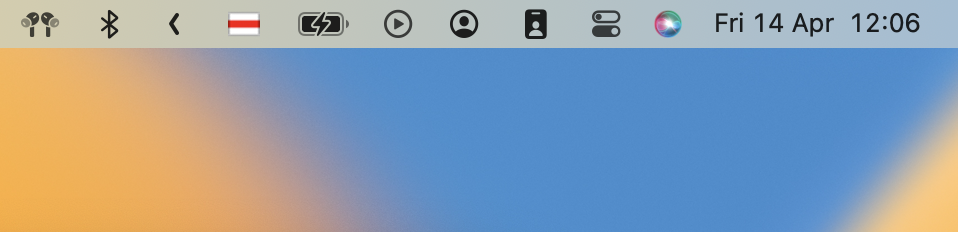

belarusian-keyboard
============

`Беларуская раскладка з сапраўдным сцягам`



Belarusian keyboard with the real white-red historical Belarusian flag for macOS.

Keyboard layouts
------------

`Belarusian` - standard `belarusian` layout with the white-red flag.

Do you still need r***ian layout on your keyboard?

`Belarusian~` - standard `r***ian` layout, but with the white-red flag and easy access to unique belarusian letters.

Belarusian-cyrillic keys:
- `alt-и` for і
- `alt-у` or ў

Keyboards are placed in `Belarusian` and `Russian` sections in Settings next to the original ones.

Installation
------------
### Homebrew

```bash
brew tap titenkov/tap
brew install belarusian-keyboard
```

To start using it, add the belarusian keyboard in the settings (*System Preferences > Keyboard > Input Sources*)

```bash
open /System/Library/PreferencePanes/Keyboard.prefPane
```
